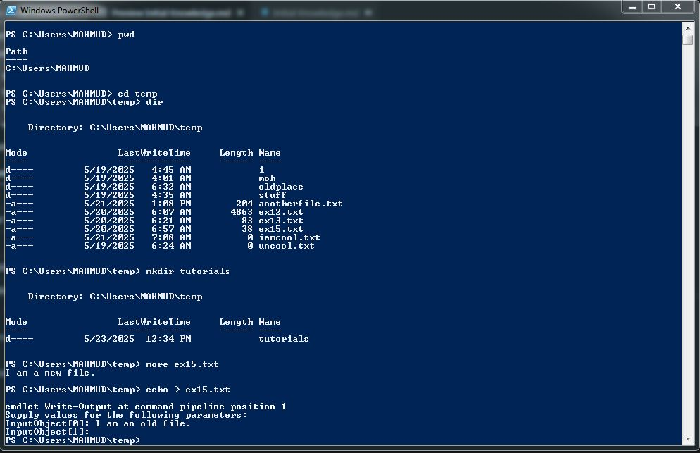

# SOFTWARE ENGINEERING
Software engineering is a field that applies principles to the design, development, testing and maintenance of software. It is a systematic approach aimed at creating high quality, reliable and maintainable software applications. Software engineers work to solve problems and create solutions using programming design and other technical skills. Software engineering encompasses:
1. Web development.
2. Mobile application development.
3. Desktop application development.
4. Blockchain development.
5. Artificial Intelligence/Machine Learning/Data Science.
6. Embedded systems and hardware programming.

# Overview of Web Development

## Introduction
The web is made up of several interconnected computers that share data and information which together make the internet work as it is. 

## Areas of Web Development
At the very first layer, web development entails the following areas:
1. **Front end development**: This deals with the visual and interactive elements of websites and web applications at the user-end that requires the techniques of html, css and javascript to develop. The interface developed is required to be user-friendly, responsive and visually appealling.
2. **Back end development**: This handles the creation of server-side and databases logic required to carry out some authentication and storage. It usually involves programming. It also hidden from the user, ensures functionality, data management and server performance.
3. **Cloud engineering**: This entails the deployment of the developed to a host company that maintains and optimises cloud-based systems which handles the day-to-day functioning of the website. This area is necessary for the website to always be available and to handle the amount of data traffic that may be encountered
4. **DevOps (Development and Operations)**: It is a practice that aims to integrate the development and operations teams by encouraging collaboration and shared responsibility. It focuses on integrating and automating processes to make software faster, more reliable and stable.
5. **User Interface/User Experience (UI/UX) design and engineering**: This deals with creation of intuitive and engaging digital products and experiences. UI is concerned with specific elements that users interact with on the screen such as buttons, icons and layouts which is usually the visual and interactive aspects of a product's interface. UX is concerned with the overall experience the user acquired when interacting with the products which include aspects such as accessibility, satisfaction and usability.

## Tools for Web Development
Tools required to develop the web are basically divided into two which are:
- Hardware: The hardware consists of the basic physical components that make up the computer system. They are visible and tangible in nature and do not require any description for an ICT compliant individual.
- Software: This is the major tool that requires acquisition of knowledge of its relevant syntax and semantics. It is abstract in nature and in form of commands. There are plenty software required for web development and are usually interactive in nature. Working with them requires skills to communicate with the computer through interfaces (*commonly referred to as Interpreters*) depending on the operating system installed in a computer. The table below gives the summary of the interface used by 3 common operating systems

| Operating System | Interface |
| --------------- | ------------ |
| Windows | PowerShell |
| MacOS | Terminal |
| Linux | Bash |

All interfaces mentioned in the table are categorised as *Command Line Inteface (CLI)*. They are employed by web developers/programmers which differentiate them from common computer users who communicate with the computer through *Graphical User Interface (GUI)*. CLIs are very more sophiscated than GUIs as they perform far more complicated task fastly and efficiently. The downside of CLIs is that it requires memorising a lot of commands and syntax which may be daunting for a beginner in the Tech profession.

### PowerShell
This interpreter comes installed in Windows operating system. It has its own command and syntax. Operating systems contain directories (folders) and files. Directories are some sort of containers used to hold files. Directories can contain other directories which can further contain other directories in an onion-like layer arrangement. The one containing other directories is *the parent directory* while the content directories are *children directory*. This arrangement also forms a *path* which serves as directions to destination of a file to the computer. Files are locations in computer memory where information can be stored. They are of different types depending on the kind of information they hold. They are usually named and their names end with extensions (e.g. '.txt', '.jpg', '.md') to indicate the information they are carrying. Files are located by specifying their path. Operations can be performed on directories and files. Operations that can be performed using PowerShell interpreter include:
- Making, changing or deleting of directories/folders.
- Making, moving, copying or deleting of files.
- Viewing, streaming or printing of files.
- and many more.

The table below shows some common commands in PowerShell

| Command | Name | Description |
| :--------- | :----------: | :---------- |
| 'dir' | list | List the contents of the current working directory |
| 'pwd' | print working directory | Returns the full path of the current directory in which the CLI is reading |
| 'cd' | change directory | Changes the current working directory to a new location |
| 'mkdir' | make directory | makes a new directory |
| 'rmdir' | remove directory | deletes a specified directory |
| [filename] | open | Opens a specifed fle in the OS environment |
| 'type' | type | Opens a specifed fle in the CLI environment |
| 'mv' | move | Moves a specifed fle or fles to a specifed destination |
| 'cp' | copy | Copies a specifed fle or fles to a specifed destination |

There are far more commands in the kit of PowerShell to carry out relatively more tasks on a computer. Some useul links are provided below for further consultation on PowerShell:

[**Owner's Manual**](http://technet.microsoft.com/en-us/library/ee221100.aspx)

[**Cheat Sheet**](http://www.microsoft.com/download/en/details.aspx?displaylang=en&id=7097)

[**Master PowerShell**](http://powershell.com/cs/blogs/ebook/default.aspx)

The picture below shows a snapshot of PowerShell:

